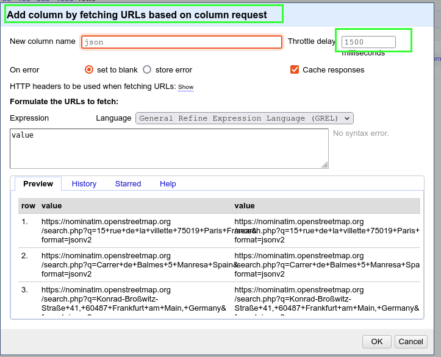
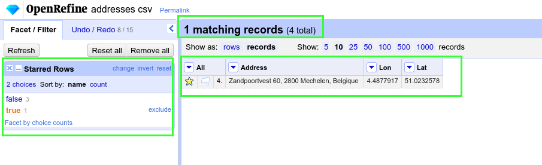
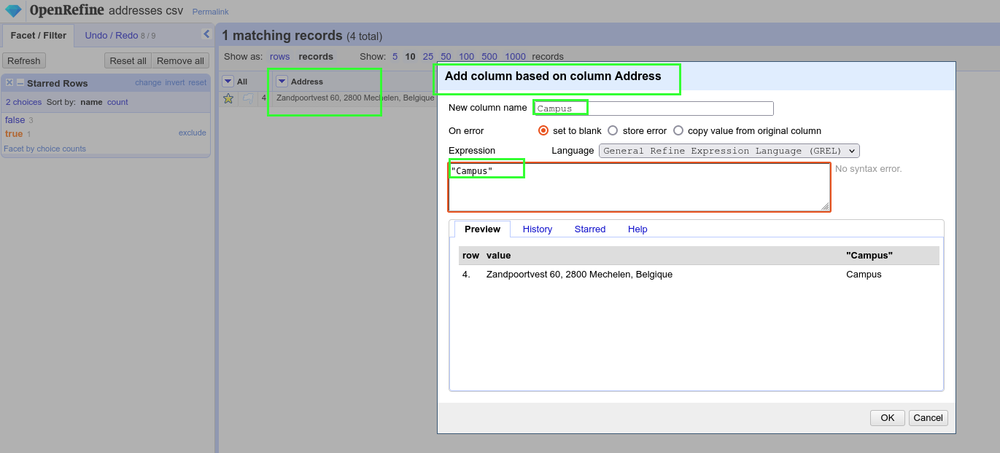
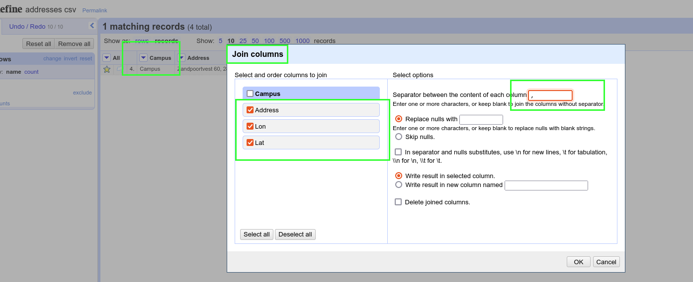
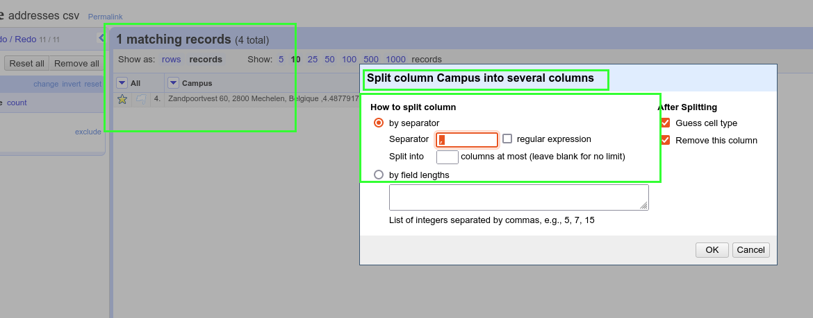
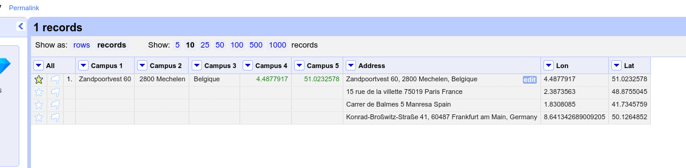
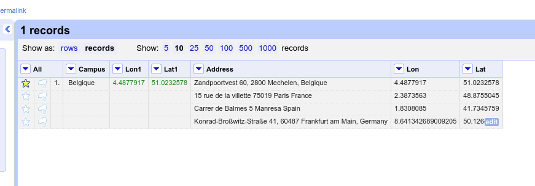
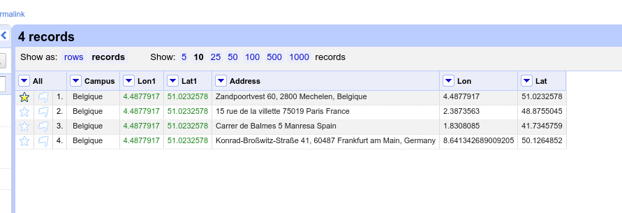
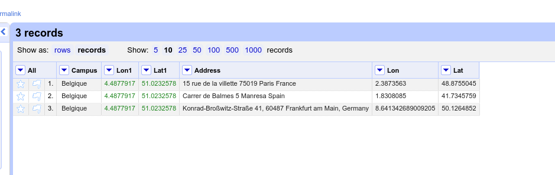

# Example ONE - Geocode and enrich using APIs

### Introduction

In this example we will geocode a bunch of adresses and calculate some distances from a fixed POI.


### Import the data

- Import the file named addresses.csv


### Geocoding with nominatim

We will use the API proposed by [Nominatim](https://nominatim.org/release-docs/latest/api/Lookup/), a free geolocation service based on OpenStreetMap.

Be nice with APIs, the limit is one request per second.

Create a new column called _request_ using the formula : 

```
"https://nominatim.openstreetmap.org/search.php?q="+value.replace(' ','+')+"&format=jsonv2"
```

Please note that we replace the space character by a plus sign at the same time.

Create a column based on this column, using the function FETCH URL

__Important Throttle delay > 1500ms to respect the API.__



You will receive the geolocation data as JSON format.

Create a new column _lat_ base ont his result using the following GREL command : 

```
value.parseJson()[0].lat
```

Do the same for a column _lon_ using this formula : 

```
value.parseJson()[0].lat
```


Remove the useless columns. ou have now three columns : address, lat, lon

## Part 2 - Calculate distances

Our goal is to calculate the distances from the addresses in Spain France and Germany, to the Campus in Mechelen.
We will use this [OSMR](http://project-osrm.org/docs/v5.24.0/api/#services) project API but first, we need to restructure the project.

### Preparing the dataset

The Mechelen Address should be in the first column as it's our point of reference.

- Star row 4 (Mechelen) and facet your project by star. Row 4 should temporarly remain alone in your project.




- Add a column called campus where the valus is "campus".



- Based on this column, join the other columns.



- Split this column using the comma separator



- sorting the column Campus1 by text should give you this result :



We can now remove column Campus 1 and Campus 2.

We rename Campus 3 as "Campus", Campus 4 as "Lon1" and Campus 5 as "Lat1".



We now use the fill fonction on Campus, Lat1 and Lat2.



And we can remove the useless first row (starred).



### Calculate distances

We use the [OSMR](http://project-osrm.org/docs/v5.24.0/api/#services) project API.

We create an URL based on Lon1 column : 

```
"http://router.project-osrm.org/route/v1/driving/"+value+","+cells['Lat1'].value+";"+cells['Lon'].value+","+cells['Lat'].value+"?overview=false"
```

- Based on this new column, create a Fetch URL column __but be aware of the throttle delay of 5000ms minimum between two requests.


- Parse this column using this formula to get the distance in kilometers.

```
(value.parseJson().routes[0].distance).toNumber()/1000
```


