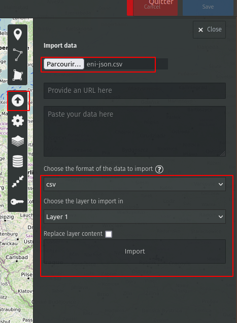

# Example TWO - Import some OSINT-obtained json data and map them

### Introduction

Using the developer tools of Firefox/Chrome, we extract the list of ENI/AGIP gas stations as a json file, import this in OpenRefine, filter the French ones and export them as a map on [umap](https://umap.openstreetmap.fr).


### Get the data

- Open firefox (or Chrome) and browse the [ENI Station Finder](https://stationfinder.enistation.fr/?locale=fr_FR).
- Open the __developer tools/network__ (F12 or using the menu) and reload the page (F5).
- Filter by XHR
- Search for the json request __get_station_list__
- Click __once__ on the request, and go to response; this should show you a part of the stations list.


- __right click__ on the request; select copy > copy as curl. You can now replay this request in a terminal and export it as a json file, by adding ```> eni.json``` at the end.

```
curl 'https://stationfinder.enistation.com/enistationfinder_be/public/index.php/api/get_station_list' -X POST -H 'User-Agent: Mozilla/5.0 (X11; Ubuntu; Linux x86_64; rv:93.0) Gecko/20100101 Firefox/93.0' -H 'Accept: application/json, text/plain, */*' -H 'Accept-Language: fr,fr-FR;q=0.8,en-US;q=0.5,en;q=0.3' --compressed -H 'Content-Type: application/json' -H 'Origin: https://stationfinder.enistation.fr' -H 'DNT: 1' -H 'Connection: keep-alive' -H 'Referer: https://stationfinder.enistation.fr/' -H 'Sec-Fetch-Dest: empty' -H 'Sec-Fetch-Mode: cors' -H 'Sec-Fetch-Site: cross-site' -H 'Pragma: no-cache' -H 'Cache-Control: no-cache' -H 'TE: trailers' --data-raw '{"credentials":{"token":"0676d96d8d3ccd46e82694e8cafb2b2152c9c9ba478322109f6663e2b8d576a3","requestId":1635865741,"device":"sdk"},"body":{"isFiltered":1,"sorgente":1,"filters":{}}}' > eni.json
```


### Import the data in OpenRefine

*nota bene : For your convenience [a version of this json file](../dataset/eni.json) is included in this repository.*

On the preview screen, move your mouse till the yellow selection completely encloses the 1st record (from id field, to fatturazione_elettronica:true). Then click on it.


You should get this view : 


Create the project.

### Filter and clean the dataset

- Rename the column __\_ - latitudine__ as __lat__, and __\_ - longitudine__ as __lon__


- Facet the __codice_nazione__ column by __facet__ and select __FRA__ on the left
	


- Export your project as csv


### Create a map

Browse to [umap](http://umap.openstreetmap.fr/en/), an opensource tool to create maps with your data. Create a new map.
Import your fresh dataset.




## Conclusion

We quickly extracted some OSINT from a website, import them in openRefine in order to cleanse them and format them as we will.
Finally, we created in 5mn an interesting geolocated map of our dataset.

Let's dive into this, by playing with APIs, with our [third example](Demos3.md)!
