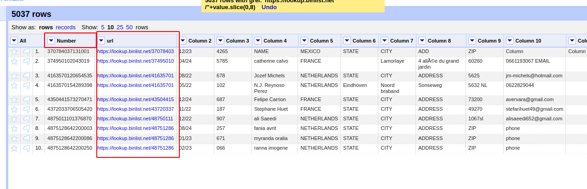
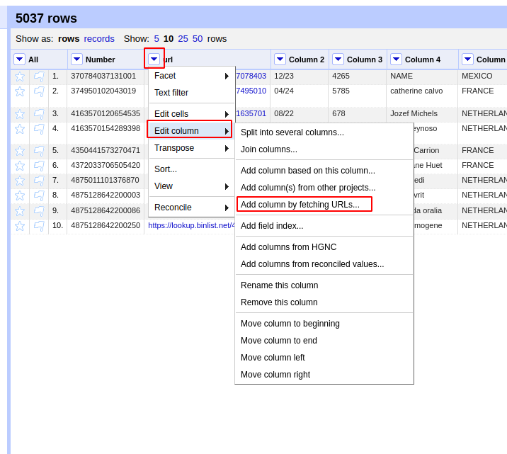
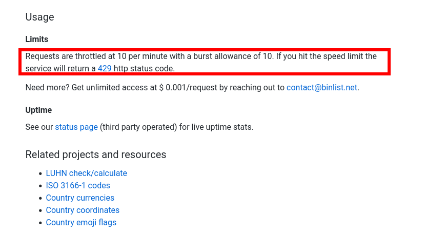
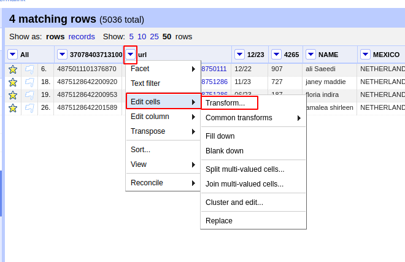
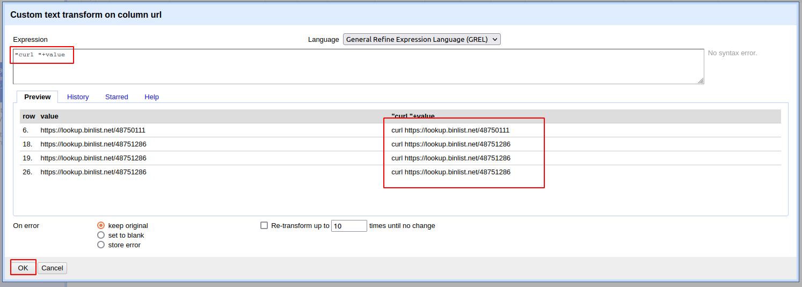
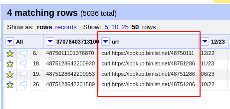
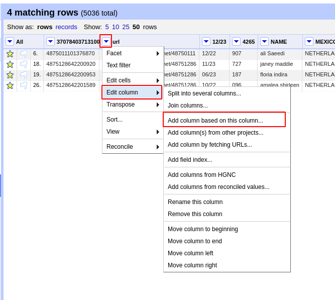
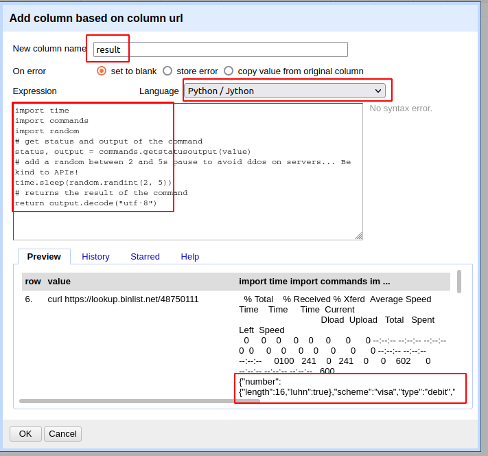
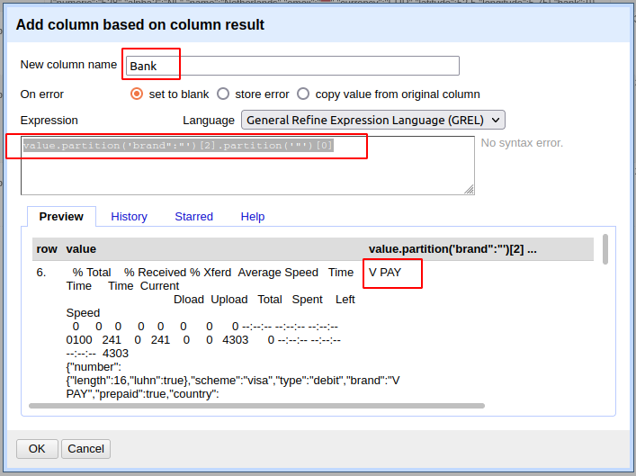

# Example THREE - Using APIs to enrich your data

### Introduction

On RaidForums, the famous cybercrime platform, you collect an interesting dataset: a list of names, credit card numbers, emails.
You want to check with bank needs to be alerted by identifying the credit card issuer.

The dataset is [```allworldcards.csv```](../dataset/allworldcards.csv).

This can be done by using the API of [BinList](https://binlist.net/).

Using the command line tool `curl`, you can request the website through its API as shown below: 

```
curl -H "Accept-Version: 3" "https://lookup.binlist.net/45717360"
```

So, just by using the first eight digits of a credit card, [https://lookup.binlist.net/45717360](https://lookup.binlist.net/45717360) will give a json file, quite handy to manipulate with OpenRefine.

__Please note that this service is not updated anymore and will be used for demo purposes__

_Another way to to do it is to use this website : https://bincheck.io/fr/_

_First : do a manual request to get the URL and the token._


### Let's refine!

#### Create the project


- Import the data in openRefine. Be sure that the first line of the dataset is not considered as a header.
- Rename the first column as "Number".
- Create a new column based on this column, that you name "url": 

The expression will be 
```
"https://lookup.binlist.net/"+value.slice(0,8)
```

It means __"Concatenate the url "https://lookup.binlist.net/" and the value of the number, by only taking the first 8 digits".__




#### Fetch the data

__BE NICE TO APIs!!...__

Important : 

The webservice indicates that it allows 10 requests per minute (one request every 6000ms). It's mandatory to respect this.
This dataset contains 5037 entries, so the full action will take approximately 9 hours...
Thus we will only work a sample of 5 entries.

- on the column "url", select __Edit column/Add column by fetching URLs...__



- name the column results, select 6000ms, store errors (just in case), click on show, remove the openrefine user-agent and click ok.



- wait for the answer.

We'll see how to parse the result at the end of this example!
__

But let's try something else, to unleash the power of Openrefine!!!

### Usint Jython and the command line

__The global concept behind this is to execute a command in a hidden terminal and collect the result in OpenRefine.__

Long time ago, Jython was the Python interpreter for Java. The problem is that its development is stalled to the 2.7 version of Python, which is, as you probably know, deprecated. What we will still use, is its ability to use core libraries from python2.7 that allow us to execute a bash command and retrieve its result. We will use three python modules : 
 - command (to execute a shell command)
 - time (to be able to generate pauses between two commands)
 - random (to add randomization to the pause)

This will give us access to common commands such as dig, whois, but also other CLI tools such as googler or other.
Virtually any python script or tools can be installed and executed in command line!

The jython script that we use is the following : 

```
import time
import commands
import random
# get status and output of the command
status, output = commands.getstatusoutput(value)
# add a random between 2 and 5s pause to avoid ddos on servers... Be kind to APIs!
time.sleep(random.randint(2, 5))
# returns the result of the command
return output.decode("utf-8")
```
#### Modifying the url column by adding curl

In the url column, we have... a url. what we want to do is to __curl__ this url.

We will simply __transform__ the content of these cells by adding "curl " before the existing content : 





__Don't forget the space character after curl__

The command lines are now ready to be executed...




#### Execute the script...



- Create a new column named _results__.
- Select the jython language (not GREL)
- Copy/Paste the script in the field expression
- Wait a few seconds to see the preview...




#### Be careful...

- Be sure that your script has the correct random pause to match the API requirements.
- The preview can take long to appear

### Parsing the content


- create a new column based on this column (you know that, now...)
- We use ```value.partition(pivot)[0.1.2]``` to extract the data.

```
value.partition('brand":"')[2].partition('"')[0]
```



