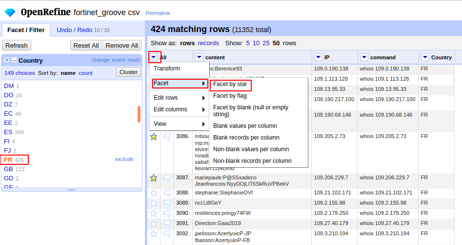
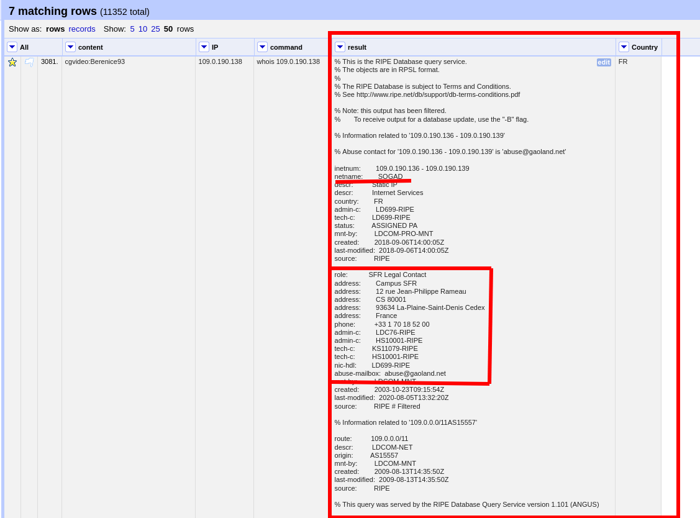
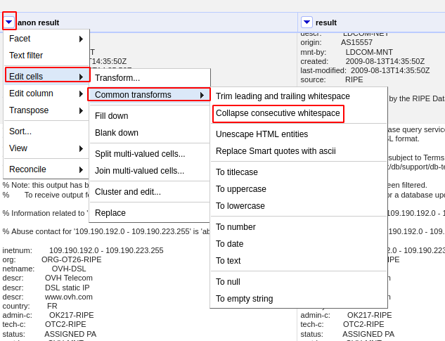
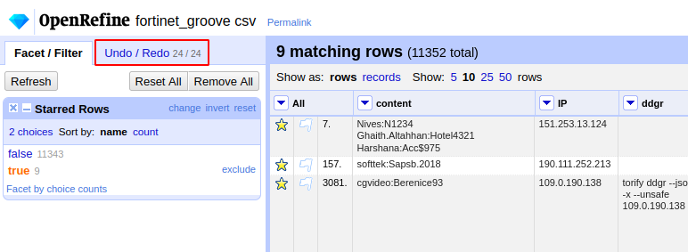
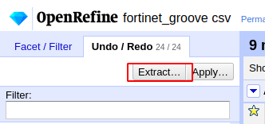
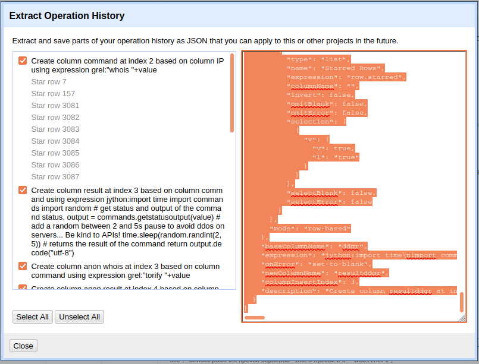

# Example FOUR - Enrich our data using the command line

### Introduction

On this example, we will use a dataset proceeding from the Groove ransomware (A [Hoax](https://krebsonsecurity.com/2021/11/the-groove-ransomware-gang-was-a-hoax/), by the way...) : a list of vulnerable Fortinet IPs.

When you receive such an information, a good move is to quickly qualify such a dataset, to identify key IPs (by country, entities, etc...).

Our suggestion is to automate a *whois* on these IP, and to parse the result and export the scenario as a __recipe__, to replay it on the same dataset.

### Import the data

- create a new project in OpenRefine by importing the csv file. Beware to select the commas separator. The project should content 3 columns and 11352 lines.
- create a new column "command" based on IP, using the formula ```"curl "+value```. 
- filter the country, by doing a text facet and click on the country of your choice (FR for example).
- randomly select 10 IPs in the dataset for the demo, by starring them.
- in the column "All", select __facet by star__ then __true__ to only display these IPs.


- execute the jython script to retrieve the infos...




__Important___ You can add a layer of anonymization, by using the *torify* command, which will wrap the command into TOR.
Instead of ```"curl "+value```, simply use ```"torify curl "+value```.


### Parse the data

A good insight is the *netname:* value that can lead you to the company that owns the IP.
We will use this expression : ```value.partition("netname:")[2].partition("descr")[0]```

But first, let's remove the useless whitespaces in the column.



Now create a new column called "netname", based on the column, using the above expression : 

```value.partition("netname:")[2].partition("descr")[0]```

### Check the reputation of an IP on DuckDuckGo


We can check the reputation of these IP using DuckDuckGo, and [ddgr](https://github.com/jarun/ddgr). The results are often less precise but ddgr can be torified!

We can create a new column based on the IP column using a request like this : ```"torify ddgr --n 20 --json -x --unsafe "+value```

- *-x* means show complete url in result
- *--unsafe* means disable safe search
- *--json* means as json format 


### Export your actions as a script









- save this recipe as a text.
- You will use this recipe with the button APPLY.